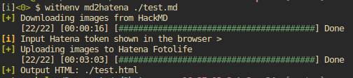

# md2hatena-rs

Easily convert HackMD note to Hatena Blog HTML.



## Usage

```bash
git clone https://github.com/smallkirby/md2hatena-rs && cd ./md2hatena-rs
./install

md2hatena ./example.md
```

## Features

- Auto donwload images from HackMD
- Auto upload images to Hatena Fotolife
- Auto replacement of image URLs
- Other misc alighnments...
